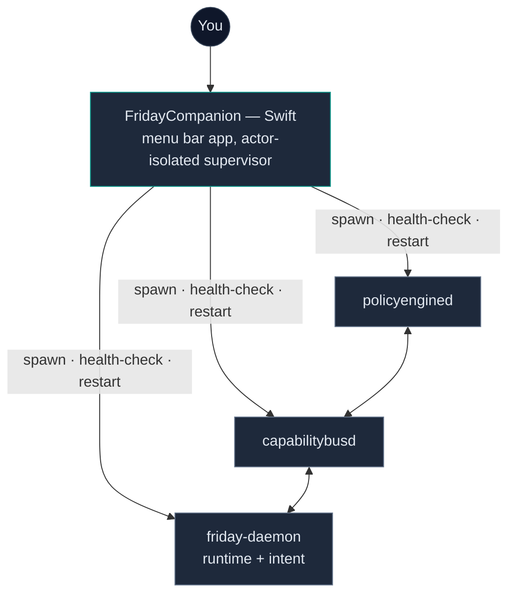
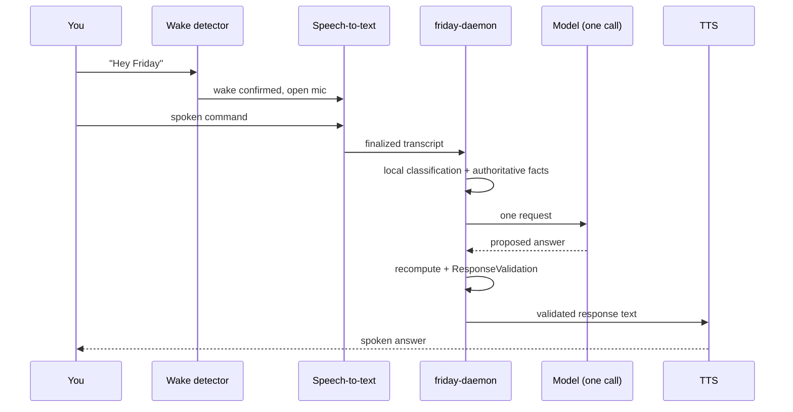
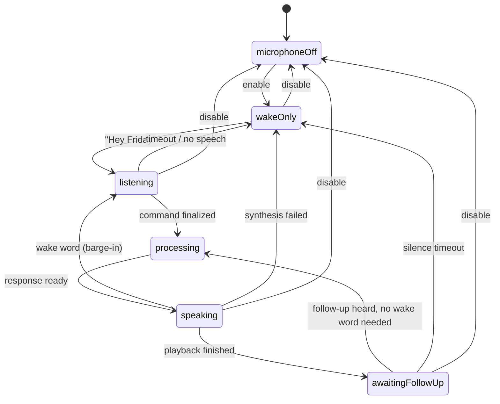

# FRIDAY

A multi-process AI runtime for macOS: a Swift companion app supervises three Go daemons over typed IPC, with a local-authority layer sitting between an LLM and anything it's allowed to say or do.

<div align="center">

[](https://github.com/Sur27codes/FRIDAY)

</div>


---

### The idea

Most voice assistants are a thin shell around a language model: you talk, the model answers, the app repeats whatever it said. FRIDAY doesn't work that way. The model gets exactly one call per turn, and whatever it returns is a *proposal* — a candidate answer that a local system checks before anything reaches a speaker. If the model says "I sent that email" and the runtime has no record of an email being sent, that sentence doesn't go out. If a question needs something the model can't actually know — your battery percentage, your calendar, whether a capability even exists — the model doesn't get to improvise; the runtime either supplies the real value or the system says it can't.

The interesting engineering isn't the LLM call. It's everything built to keep that one call honest.

## Architecture



The three Go processes are deliberately separate, not one monolith: `policyengined` owns what's allowed, `capabilitybusd` routes capability calls, `friday-daemon` holds runtime state and intent resolution. Each talks to the others only over a length-prefixed JSON protocol on Unix domain sockets — nothing shares memory, so a crash in one is a crash in one.

The Swift side is an `actor`-isolated supervisor, not a shell script. It owns process lifecycle for all three daemons: health polling, bounded crash-restart with backoff, a crash-loop cutoff so a broken daemon doesn't spin forever, and orphan recovery that's fail-closed by construction — a leftover process only ever gets reclaimed if a sidecar record can prove it's this app's own orphan from a previous run. An unidentified live process on the expected socket path is never touched, full stop.

## One turn, start to finish



One round trip to the model, not a chain of them — the classification before it and the validation after it both happen locally, which is also why a single bad response can't spiral into a retry loop.

## The microphone's actual state machine

This is the real state machine driving the menu bar icon — not a simplification of it:



The detail that matters most here: `speaking → awaitingFollowUp` only fires once real audio playback has finished — not when the model finishes generating, not on a timer. Those are two different events, and conflating them is exactly the kind of bug that makes an assistant cut itself off mid-sentence.

## Voice pipeline


Three voice tiers, tried in order, but the fallback rule only matters once you've actually said something out loud: if Cartesia starts speaking and then drops the connection mid-sentence, the system does not let Chatterbox replay the answer from the top — that's a worse experience than the failure itself. A fallback only ever engages before the first audible word. Saying the wake word again while FRIDAY is talking stops playback immediately and starts a fresh capture; while it's talking, the microphone's active transcription stays closed so it never mistakes its own voice for a new command.

## What's built

- On-device wake-word detection and speech-to-text — no network round-trip just to notice you said "Hey Friday"
- A local-authority layer (`ResponseValidation`) that rejects model claims unsupported by actual runtime state, instead of trusting the model's own account of what happened
- A process supervisor with health checks, bounded restart, crash-loop cutoff, and fail-closed orphan recovery
- Three-tier TTS with a no-replay-after-playback guarantee and wake-word barge-in
- Credentials in macOS Keychain exclusively — nothing in source, config, or logs

## Notable fixes

A few of the harder bugs, because the fix is usually more interesting than the feature:

| What broke | Why | Fix |
|---|---|---|
| Helper processes survived quitting the app | The shutdown task inherited `MainActor` isolation while the main thread blocked on it *synchronously* — the cleanup task could never actually be scheduled | Detached the cleanup task off the isolated actor, with a bounded wait on the main thread instead of an unbounded one |
| A fast relaunch sometimes left every service permanently marked failed | A single socket-liveness check couldn't distinguish "a dead orphan" from "the previous instance is still finishing its own shutdown" | Replaced the one-shot check with a bounded recheck window sized to match the shutdown timeout |
| All three daemons failed on a freshly updated machine | The bundled binaries were x86_64; a macOS update had quietly removed Rosetta 2, so `exec` failed with "bad CPU type in executable" — not a FRIDAY bug, an environment one, but FRIDAY had to detect and survive it | Cross-compiled natively to `arm64` and dropped the Rosetta dependency rather than just reinstalling it |
| General-knowledge questions got refused instead of answered | "No capability matched" was being conflated with "this action is unsupported," so the model was told outright it *couldn't* answer | Split "no capability needed" from "capability needed but missing" as distinct states |
| "Explain X in five sentences" sometimes produced a one-word reply | Grammatically an imperative, so the classifier filed it as a statement rather than a request for information | Added recognition for information-seeking imperatives specifically |

## Testing

1,666 test functions across three languages — unit tests, pure state-machine tests against the supervisor and wake-word engines, and integration tests that spawn the real subprocesses and talk to them over the real IPC protocol, not mocks of it.

| | Swift | Go | Python |
|---|---|---|---|
| Tests | 1,369 | 260 | 37 |
| Scope | companion app + core logic | all 9 service modules | dataset tooling |
| Verified this session | — | all passing | all passing |

## Getting started

```bash
# Go daemons
cd services/policy-engine   && go build ./...
cd services/capability-bus  && go build ./...
cd services/runtime         && go build ./...

# wake-word engine + model weights — not committed, fetched on demand
./scripts/fetch_models.sh

# macOS companion
cd macos/FridayCompanion && swift build --product FridayCompanion
```

No `.env` file — provider credentials are read from macOS Keychain. First launch will prompt for microphone and speech-recognition permission; both are required.

## Security & privacy

- Keychain-only credentials
- Unidentified processes are never killed — ownership checks fail closed
- Listening windows are time-bounded, not always-on
- The model has no direct, unrestricted control of the machine

Report a vulnerability: see [SECURITY.md](SECURITY.md).

## License

No license file yet — all rights reserved for now, revisiting this later.

---

**Sur Vaghasiya** — [LinkedIn](https://www.linkedin.com/in/sur-vaghasiya-031ab9283) · [Portfolio](https://sur-portfolio.vercel.app/) · [GitHub](https://github.com/Sur27codes)
