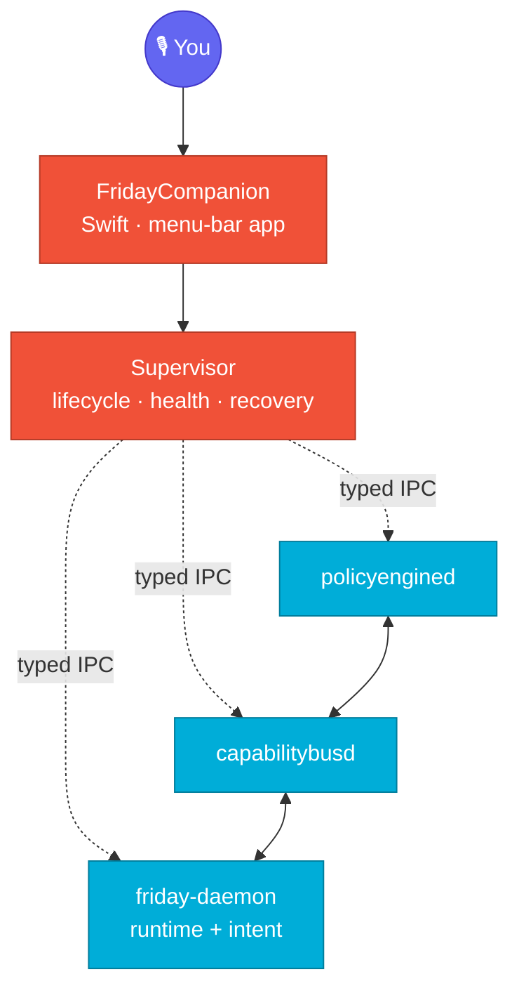

<div align="center">


[](https://github.com/Sur27codes/FRIDAY)


-lightgrey)

</div>

---

FRIDAY is a voice-driven AI runtime that lives on my Mac as a menu-bar companion. Say "Hey Friday," ask it something, and it answers out loud — but the part I actually care about is everything standing between your voice and that answer.

The language model never touches the machine directly. It proposes an answer; a local runtime decides whether that answer is actually true and whether any action it implies is actually allowed. If the model can't know something — your battery level, whether an email really sent — it doesn't get to guess. A Swift companion app supervises the Go processes that do that deciding, and if any of them die, it knows the difference between "safe to restart" and "something I shouldn't touch."

That's the whole project, really: an LLM that's allowed to talk, and a system underneath it that doesn't blindly believe what it says.

## How it's put together

<div align="center">



</div>

Three independent Go daemons, one Swift process watching all of them. `policyengined` decides what's allowed, `capabilitybusd` routes capability calls, `friday-daemon` holds the actual runtime and intent logic. None of them talk to each other except through typed IPC the Supervisor can observe.

## The voice path

```mermaid
graph LR
    Wake["🔈 Wake word<br/>sherpa-onnx, on-device"]
    STT["Speech → text"]
    Local["Local classification<br/>+ authoritative facts"]
    Model["🧠 One model call"]
    Recompute["Local recomputation"]
    Validate["ResponseValidation"]
    TTS1["Cartesia"]
    TTS2["Chatterbox<br/>local"]
    TTS3["macOS voice"]
    Out((🔊 Spoken answer))

    Wake --> STT --> Local --> Model --> Recompute --> Validate
    Validate --> TTS1
    TTS1 -.->|fails before playback| TTS2
    TTS2 -.->|fails before playback| TTS3
    TTS1 --> Out
    TTS2 --> Out
    TTS3 --> Out
    Out -.->|say the wake word again to barge in| Wake

    classDef stage fill:#1e293b,stroke:#0ea5e9,color:#fff
    classDef voice fill:#6366f1,stroke:#4338ca,color:#fff
    classDef io fill:#0ea5e9,stroke:#0369a1,color:#fff
    class Wake,STT,Local,Model,Recompute,Validate stage
    class TTS1,TTS2,TTS3 voice
    class Out io
```

<div align="center">



</div>

Only one call ever goes out to the model per turn. Everything before it is local; everything after it is a local system double-checking the model's answer before anything gets spoken out loud. If the primary voice fails mid-sentence, the fallback picks up the *next* sentence — it never replays what you already heard.

## Built with

<div align="center">


</div>

- **Swift** — the companion app, menu bar UI, process supervisor
- **Go** — `policyengined`, `capabilitybusd`, `friday-daemon`
- **Python** — the local Chatterbox TTS service
- **sherpa-onnx** — fully on-device wake-word detection
- **Cartesia → Chatterbox → macOS voice** — a three-tier fallback so a network hiccup never means silence

## Getting started

```bash
# the Go helpers
cd services/policy-engine   && go build ./...
cd services/capability-bus  && go build ./...
cd services/runtime         && go build ./...

# wake-word engine + model weights (not committed — fetched on demand)
./scripts/fetch_models.sh

# the macOS companion
cd macos/FridayCompanion
swift build --product FridayCompanion
```

Provider credentials live in macOS Keychain — there's no `.env` file to fill in. On first launch, macOS will ask for microphone and speech-recognition permission; it needs both.

## Security & privacy

- Credentials: Keychain only, never in source, config, or logs
- An unidentified process never gets killed — ownership checks fail closed, not open
- FRIDAY doesn't transcribe its own voice as a new command
- Listening windows are time-bounded — the mic isn't open by default
- The model proposes; it never gets direct, unrestricted control of the machine

Found a real issue? See [SECURITY.md](SECURITY.md).

## License

No license file yet, so all rights are reserved for now — revisiting this later.

---

<div align="center">

**Sur Vaghasiya**

[](https://www.linkedin.com/in/sur-vaghasiya-031ab9283)
[](https://sur-portfolio.vercel.app/)
[](https://github.com/Sur27codes)


</div>
