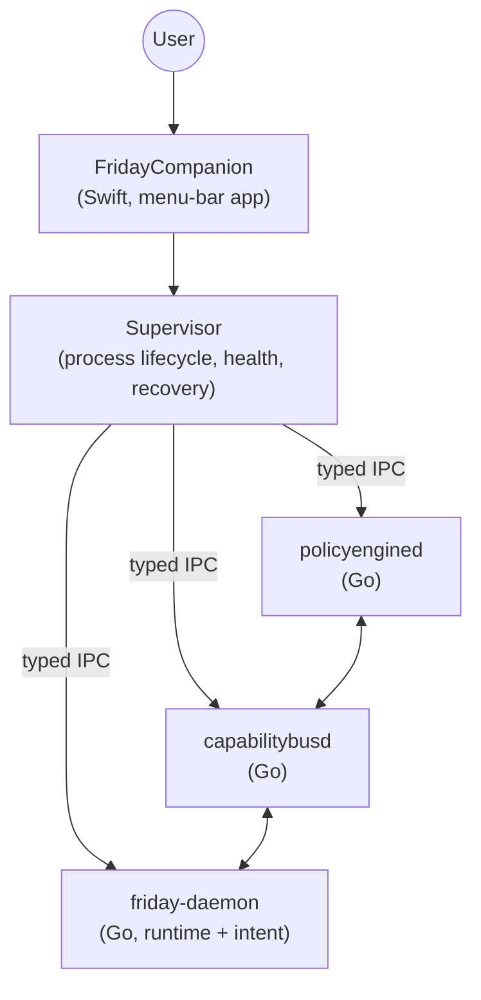
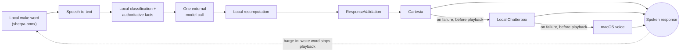

# FRIDAY

A multi-process AI runtime for macOS with local authority over an LLM, process supervision, and a real-time voice pipeline.

**Status:** in active development, not yet released.

## How it's put together

A native Swift companion app supervises three Go helper processes over typed IPC. The companion never gives the language model direct control of the machine — the model proposes, and a local runtime decides what's actually true and what's actually allowed.



## Voice and conversation path



## Tech stack

- Swift (companion app, macOS 13+)
- Go (`policyengined`, `capabilitybusd`, `friday-daemon`)
- Python (local Chatterbox TTS service, voice-dataset tooling)
- sherpa-onnx (local wake-word detection)
- Cartesia, local Chatterbox, and the macOS system voice as a three-tier TTS fallback

## Getting started

```bash
# Go helpers
cd services/policy-engine && go build ./...
cd services/capability-bus && go build ./...
cd services/runtime && go build ./...

# Vendored wake-word engine + model weights (not committed — fetched on demand)
./scripts/fetch_models.sh

# macOS companion app
cd macos/FridayCompanion
swift build --product FridayCompanion
```

Provider credentials are read from macOS Keychain only — there is no `.env` file. On first launch, grant microphone and speech-recognition permissions when macOS prompts for them.

## Security & privacy

- Provider credentials live in Keychain only, never in source, config, or logs
- Unknown or unidentified processes are never terminated — process ownership fails closed
- The app does not treat its own synthesized speech as a user command
- Active listening windows are time-bounded, not always-on
- The language model has no direct, unrestricted control over the machine

See [SECURITY.md](SECURITY.md) to report a vulnerability.

## License

No license file is included yet, so all rights are reserved by default — this will be revisited.

## Author

**Sur Vaghasiya**
[LinkedIn](https://www.linkedin.com/in/sur-vaghasiya-031ab9283) · [Portfolio](https://sur-portfolio.vercel.app/) · [GitHub](https://github.com/Sur27codes)
